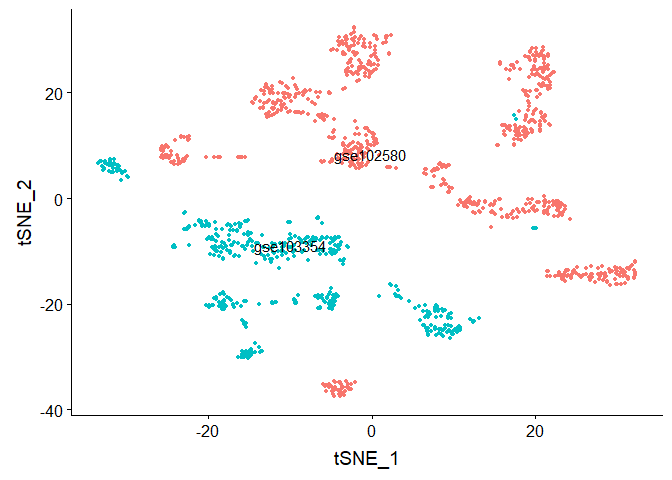
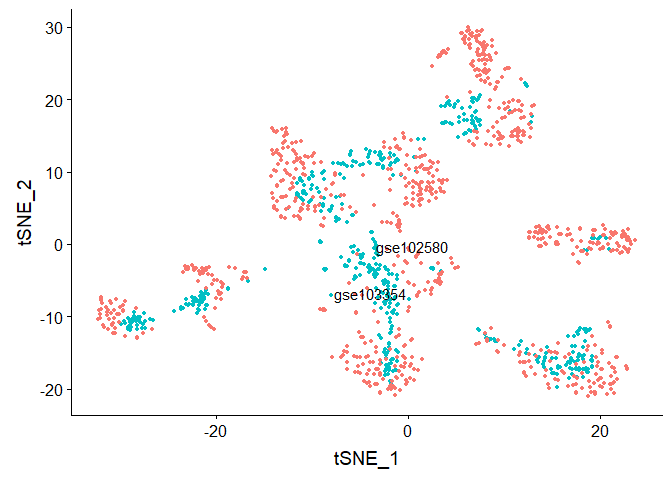

## Alignment of scRNA-seq data from the mouse airway epithelium

In this section, we will learn how to take two separate datasets and "integrate" them, so that cells of the same type (across datasets) roughly fall into the same region of the scatterplots (instead of separating by dataset first). Integration is typically done in a few different scenarios, e.g., 1) if you collect data from across multiple conditions / days / batches / experimentalists / etc. and you want to remove these technical confounders, 2) if you are doing a case control study (as we are here) and you want to identify which cells match across condition, or 3) you have performed an experiment sequencing cells from a tissue (e.g. lung epithelium) and you want to label the cells by type, but you don't have marker genes available, however, you do have access to a database of annotated cells that you could map onto your dataset.

Here we will perform alignment as if we do not have any labels (case 3), but we will use the labels after alignment to check its accuracy. The following R markdown illustrates how to do integration with Seurat, and aligns two datasets pretty successfully.


```r
library(Seurat)
```

```
## Registered S3 method overwritten by 'R.oo':
##   method        from       
##   throw.default R.methodsS3
```

```r
library(ggplot2)
library(cowplot)
```

```
## 
## Attaching package: 'cowplot'
```

```
## The following object is masked from 'package:ggplot2':
## 
##     ggsave
```

```r
#download.file('https://ucdavis.box.com/shared/static/zgxdsp3nwhzixpkeitftkgzq3phlsear.rdata','scRNA.workshop.alignment.airway.rdata')
load('scRNA.workshop.alignment.airway.rdata')

#for now, make the name of the cells just the name of the dataset, so we can easily visualize batch or condition effect
for (ii in 1:length(seuratObjs)) {
  Idents(seuratObjs[[ii]])=names(seuratObjs)[ii];
};

#load data
gse103354.data <- seuratObjs[['gse103354']];
gse102580.data <- seuratObjs[['gse102580']];
rm(seuratObjs);

compData.list <- list("gse103" = gse103354.data, "gse102" = gse102580.data)

  
#normalize, find HVGs
for (i in 1:length(x = compData.list)) {
  compData.list[[i]] <- NormalizeData(object = compData.list[[i]], verbose = FALSE)
  compData.list[[i]] <- FindVariableFeatures(object = compData.list[[i]], selection.method = "vst", nfeatures = 2000, verbose = FALSE)
}
```


Let's take a quick peek to see what cell types are annotated in each study.


```r
levels(factor(gse103354.data@meta.data$type))
```

```
## [1] "gse103354_Basal"          "gse103354_Ciliated"      
## [3] "gse103354_Club"           "gse103354_Goblet"        
## [5] "gse103354_Ionocyte"       "gse103354_Neuroendocrine"
## [7] "gse103354_Tuft"
```

```r
levels(factor(gse102580.data@meta.data$type))
```

```
##  [1] "gse102580_Basal"                       
##  [2] "gse102580_Brush"                       
##  [3] "gse102580_Ciliated"                    
##  [4] "gse102580_Cycling Basal (homeostasis)" 
##  [5] "gse102580_Cycling Basal (regeneration)"
##  [6] "gse102580_Ionocytes"                   
##  [7] "gse102580_Krt4/13+"                    
##  [8] "gse102580_PNEC"                        
##  [9] "gse102580_Pre-ciliated"                
## [10] "gse102580_Secretory"
```


Now we will visualize the data without alignment.


```r
  dat1=gse102580.data;
  dat2=gse103354.data;
  dat1 <- ScaleData(object = dat1)
```

```
## Centering and scaling data matrix
```

```r
  dat2 <- ScaleData(object = dat2)
```

```
## Centering and scaling data matrix
```

```r
  dat1 <- FindVariableFeatures(object = dat1, mean.function = ExpMean, dispersion.function = LogVMR, x.low.cutoff = 0.125, x.high.cutoff = 4, y.cutoff = 0.5)
   dat2 <- FindVariableFeatures(object = dat2, mean.function = ExpMean, dispersion.function = LogVMR, x.low.cutoff = 0.125, x.high.cutoff = 4, y.cutoff = 0.5)
  
  
 gse.combined <- merge(x = dat1, y = dat2, add.cell.ids = c("gse102580", "gse103354"), project = "airwayepithelium")

 rm(dat1,dat2)
 
 gse.combined <- ScaleData(object = gse.combined)
```

```
## Centering and scaling data matrix
```

```r
  gse.combined <- FindVariableFeatures(object = gse.combined, mean.function = ExpMean, dispersion.function = LogVMR, x.low.cutoff = 0.125, x.high.cutoff = 4, y.cutoff = 0.5)
  
    gse.combined <- RunPCA(object = gse.combined, npcs = 30, verbose = FALSE)

      gse.combined <- RunTSNE(object = gse.combined, reduction = "pca", dims = 1:20)
  DimPlot(object = gse.combined, reduction = "tsne", group.by = "stim", label = TRUE, 
                repel = TRUE) + NoLegend()
```

```
## Warning: Using `as.character()` on a quosure is deprecated as of rlang 0.3.0.
## Please use `as_label()` or `as_name()` instead.
## This warning is displayed once per session.
```

<!-- -->

```r
        gse.combined <- RunTSNE(object = gse.combined, reduction = "pca", dims = 1:20)
  DimPlot(object = gse.combined, reduction = "tsne", group.by = "type", label = TRUE, 
                repel = TRUE) + NoLegend()
```

<!-- -->

```r
  rm(gse.combined)
```
  

Now visualize after alignment.
  

```r
  #find anchors
  reference.list <- compData.list[c("gse102", "gse103")]
  compData.anchors <- FindIntegrationAnchors(object.list = reference.list, dims = 1:30)
```

```
## Computing 2000 integration features
```

```
## Scaling features for provided objects
```

```
## Finding all pairwise anchors
```

```
## Running CCA
```

```
## Merging objects
```

```
## Finding neighborhoods
```

```
## Finding anchors
```

```
## 	Found 16701 anchors
```

```
## Filtering anchors
```

```
## 	Retained 7652 anchors
```

```
## Extracting within-dataset neighbors
```

```r
  compData.integrated <- IntegrateData(anchorset = compData.anchors, dims = 1:30)
```

```
## Merging dataset 2 into 1
```

```
## Extracting anchors for merged samples
```

```
## Finding integration vectors
```

```
## Finding integration vector weights
```

```
## Integrating data
```

```r
  rm(reference.list, compData.anchors)


  DefaultAssay(object = compData.integrated) <- "integrated"
  
  #visualize
    
  # Run the standard workflow for visualization and clustering
  compData.integrated <- ScaleData(object = compData.integrated, verbose = FALSE)
  compData.integrated <- RunPCA(object = compData.integrated, npcs = 30, verbose = FALSE)
  compData.integrated <- RunTSNE(object = compData.integrated, reduction = "pca", dims = 1:30)
  DimPlot(object = compData.integrated, reduction = "tsne", group.by = "stim", label = TRUE, 
                repel = TRUE) + NoLegend()
```

<!-- -->

```r
  DimPlot(object = compData.integrated, reduction = "tsne", group.by = "type", label = TRUE, 
                repel = TRUE) + NoLegend()
```

<!-- -->

## Group assignment 1

Check the help of FindIntegrationAnchors. What happens when you change k.anchor, k.filter and k.score.

## Discussion points

Statistical significance?
When does alignment make sense?
How do you know when alignment makes sense?

## Group assignment 2

Try aligning single cells across the human and mouse cortex:

```r
#download.file('https://ucdavis.box.com/shared/static/zxouwrqb7pm9t64gqyuqdrl637749a7y.rdata','allen.expr.rdata')
#load('allen.expr.rdata')
#Tip: Look at e.g. seuratObjs[[1]]@meta.data. Columns "cluster_type_label" and "cluster_subtype_label" will be useful for visualization.
```
